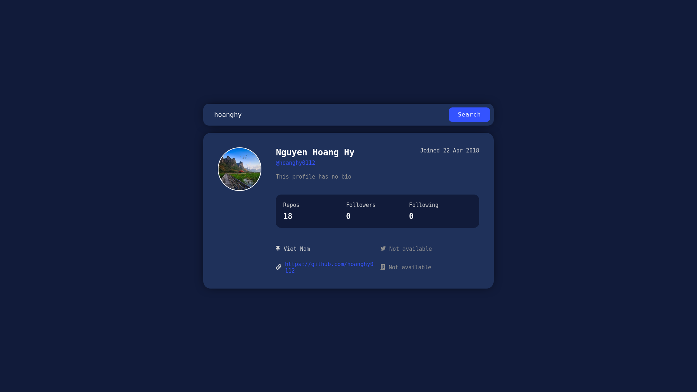

# Github-profile app

 
 
  
###
Search github user by their username  
[https://hoanghy0112.github.io/github-profile/](https://hoanghy0112.github.io/github-profile/)

### Design prototype
[Here](https://www.frontendmentor.io/challenges/github-user-search-app-Q09YOgaH6) is the design prototype of this app

### Preview image

### Libraries and techniques
- React and React Hooks
- Redux and Redux toolkit
- React Router
- Sass
- Github API

### Running locally
1. Clone the respository
2. Install `npm`
3. Run `npm install` to install dependencies
4. Run the server with `npm start`
5. Visit `http://localhost:5000/`

### Problems
- Some bugs when API fail to work  [**Not fixed**]
- Github API has a strict limit for unauthenticated users as 60 requests/hour, so each time we search we must click `search` button 

### Next version
- Authenticate and add feature that app will search for result each time we type in the search box
- Add loading effect and card `Not found` if it doesn't exist any user match the username we type in
- Error catching feature 